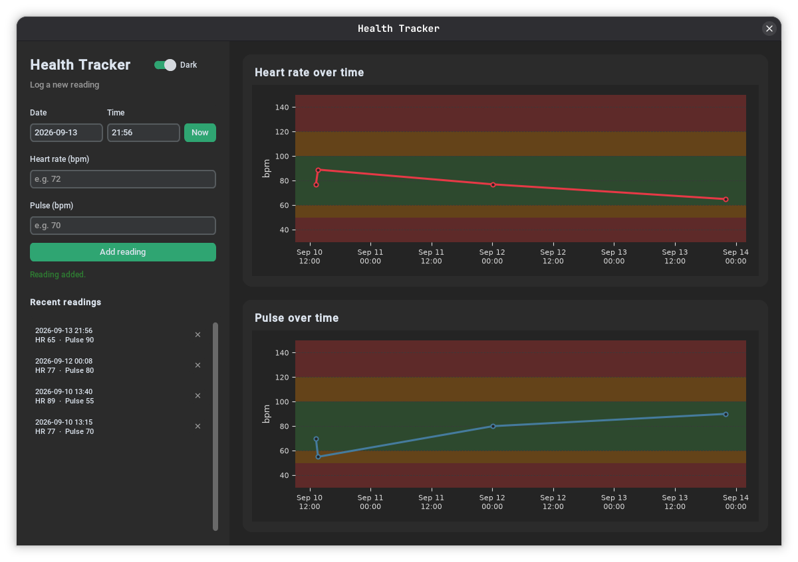

# Pulser - personal health tracker

Pulser is a lightweight personal desktop app for logging your heart rate and pulse and watching them change over time — with color-coded reference zones and a dark interface by default. No notifications, no AI, no paywalls.



## Features

- Log heart rate and pulse readings with a date, time, and a one-tap **Now** button
- Live charts for both metrics, shaded into green (normal), orange (borderline), and red (too low / too high) reference zones
- Dark mode by default, with a one-click toggle to light
- Recent readings list with quick delete
- All data stays local in a plain CSV file — no account, no cloud
- Packaged as a standalone app for Windows and Linux — nothing to install to just run it once it's built

## Download

Pulser doesn't have one combined build — pick the branch that matches your OS from the branch dropdown on GitHub (or `git clone -b <branch>`).

### Windows — `windows_desktop` branch

1. Download the `windows_desktop` branch (Code → Download ZIP, or `git clone -b windows_desktop`).
2. Make sure Python 3.9+ is installed and on your PATH.
3. Run `build.bat` (double-click it, or run it from a terminal).
4. When it finishes, the app is in the `dist` folder.

### Linux — `linux_desktop` branch (tested on Fedora)

1. Download the `linux_desktop` branch (Code → Download ZIP, or `git clone -b linux_desktop`).
2. Run:
   ```bash
   bash build_linux.sh
   ```
   This installs `python3-tkinter` with `dnf` if it's missing (you may be asked for your password), sets up a virtual environment, builds the app, and adds it to your applications menu with an icon.
3. Search for it in your app launcher, or run the binary directly from the path the script prints at the end.

   On a non-Fedora distro, the script's `dnf` line is the only part that's Fedora-specific — swap it for your package manager's equivalent (e.g. `apt install python3-tk` on Debian/Ubuntu) and the rest works the same.

Either way, the build script only needs to be run again if you change the code — the resulting app runs on its own afterward.

## How it works

- Fill in the sidebar form and hit **Add reading** to log a new entry.
- Both charts update immediately and re-scale as your data grows.
- The colored bands are general reference ranges (60–100 bpm = normal), not medical advice — adjust `ZONE_BOUNDS` near the top of `app.py` if you want different thresholds.
- Readings are stored in a CSV file in your user data folder (`%APPDATA%` on Windows, `~/.local/share` on Linux) rather than next to the app itself, so your history survives updates and rebuilds.

## Built with

- [Python](https://www.python.org/)
- [CustomTkinter](https://github.com/TomSchimansky/CustomTkinter)
- [Matplotlib](https://matplotlib.org/)
- [PyInstaller](https://pyinstaller.org/)
